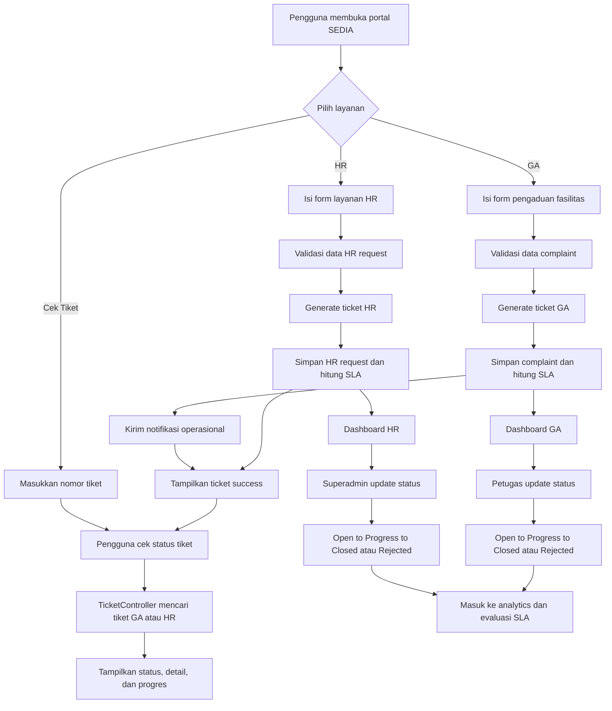
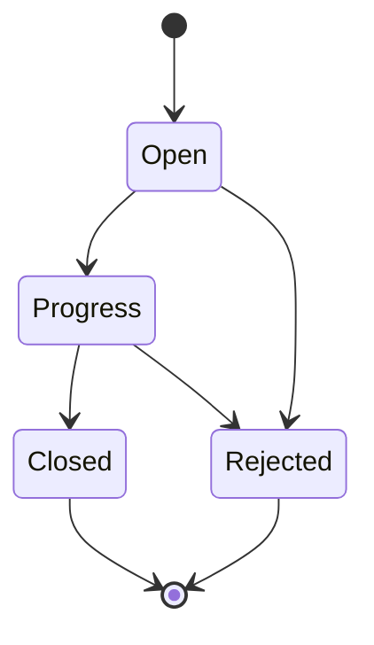
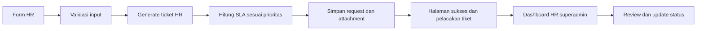

# SEDIA - GA Facility & HR Service Management

<p align="center">
  
</p>

<p align="center">
  Aplikasi layanan internal berbasis Laravel untuk pengelolaan pengaduan fasilitas GA, permintaan HR, pelacakan tiket, dashboard operasional, analitik, dan notifikasi.
</p>

## Gambaran Umum

SEDIA adalah aplikasi layanan internal yang menyatukan dua proses utama dalam satu halaman publik:

- `GA Facility Complaint` untuk pengaduan fasilitas, kebersihan, dan laundry.
- `HR Request` untuk kebutuhan administrasi dan layanan Human Resources.

Setelah pengguna mengirim laporan, sistem membuat nomor tiket otomatis, menghitung target SLA, menyimpan lampiran, dan menyediakan pelacakan status tiket. Di sisi internal, operator dan superadmin dapat memonitor dashboard, memperbarui status, melihat analitik, serta menerima notifikasi operasional.

## Tujuan Aplikasi

- Menyediakan kanal layanan internal yang cepat, sederhana, dan terdokumentasi.
- Memisahkan penanganan berdasarkan jenis layanan dan role petugas.
- Menjaga transparansi progres melalui nomor tiket dan halaman cek status.
- Membantu pengambilan keputusan lewat dashboard operasional dan analitik.
- Mendorong perbaikan berkelanjutan melalui monitoring SLA dan evaluasi data.

## Cakupan Modul

### 1. Portal layanan publik

Halaman `GET /` berisi tiga mode layanan dalam satu UI:

- `Human Resources`
- `GA`
- `Cek Tiket`

Fungsi utama:

- Submit permintaan HR tanpa login.
- Submit pengaduan GA tanpa login.
- Cek tiket HR dan GA dari satu halaman.
- Upload lampiran/foto.
- Dukungan multi-language di antarmuka publik.

### 2. Complaint Management GA

Modul ini menangani pengaduan fasilitas dengan tipe:

- `receptionist`
- `hk`
- `laundry`

Fitur inti:

- Generate ticket otomatis: `RCP`, `HKP`, `LDY`
- SLA otomatis berdasarkan tipe dan prioritas
- Upload hingga 6 foto
- Status tiket: `open`, `progress`, `closed`, `rejected`
- Catatan admin dan histori penyelesaian

### 3. HR Request Management

Modul ini menangani kebutuhan layanan HR seperti:

- surat keterangan kerja
- payroll atau slip gaji
- absensi, cuti, izin
- benefit, BPJS, asuransi
- rekrutmen atau onboarding
- konsultasi hubungan kerja

Fitur inti:

- Generate ticket otomatis: `HR-0001`
- Prioritas: `normal`, `penting`, `mendesak`
- Upload lampiran dokumen
- Dashboard khusus HR untuk `superadmin`
- Monitoring overdue dan performa penyelesaian

### 4. Dashboard operasional

Dashboard internal menampilkan:

- total tiket
- tiket open
- tiket progress
- tiket closed
- tiket rejected
- overdue SLA
- trend laporan
- outstanding workload

Hak akses:

- `superadmin` melihat seluruh complaint GA, dashboard HR, analytics, dan user management
- `receptionist` melihat complaint tipe receptionist
- `hk` melihat complaint tipe housekeeping
- `laundry` melihat complaint tipe laundry

### 5. Analitik dan monitoring

Analitik aplikasi mencakup:

- distribusi complaint per tipe
- distribusi status
- top building atau area
- SLA compliance
- tren harian atau bulanan
- distribusi hari dan jam laporan
- analitik pelapor teraktif

### 6. Notifikasi

Sistem sudah mengintegrasikan:

- notifikasi WhatsApp grup untuk complaint baru
- web push notification untuk user yang subscribe
- PWA manifest, service worker, dan offline page

## Flow Proses Aplikasi

### Flow proses utama



### Flow status tiket



### Flow proses GA

```mermaid
flowchart LR
    A[Form GA] --> B[Validasi input]
    B --> C[Generate ticket RCP HKP LDY]
    C --> D[Set priority sedang]
    D --> E[Hitung SLA deadline]
    E --> F[Simpan complaint]
    F --> G[Upload foto ke storage public]
    G --> H[Notifikasi WhatsApp dan Web Push]
    H --> I[Dashboard operator]
    I --> J[Update status dan admin notes]
```



### Flow proses HR



## Penjelasan Sistem Berdasarkan PDCA

Pendekatan PDCA membantu menjelaskan bagaimana aplikasi ini mendukung perbaikan layanan secara berulang, bukan sekadar pencatatan tiket.

### Plan

Tahap `Plan` diwujudkan saat organisasi mendefinisikan struktur layanan dan target respons:

- jenis layanan dipisahkan menjadi `receptionist`, `hk`, `laundry`, dan `HR`
- prioritas dan SLA ditentukan di model
- master data bangunan dan perusahaan disiapkan di konfigurasi
- role petugas dipisahkan agar setiap tim fokus pada domain kerjanya

Maknanya, aplikasi sudah menanamkan standar layanan sebelum tiket masuk.

### Do

Tahap `Do` terjadi saat operasional berjalan:

- pengguna mengirim laporan atau request lewat form publik
- sistem memvalidasi data lalu menyimpan tiket
- nomor tiket dibuat otomatis
- lampiran disimpan ke storage
- notifikasi dikirim ke kanal operasional
- petugas memproses tiket melalui dashboard

Maknanya, proses eksekusi layanan terdigitalisasi dan terdokumentasi.

### Check

Tahap `Check` dilakukan melalui monitoring dan evaluasi:

- dashboard menampilkan open, progress, closed, rejected, dan overdue
- analitik menunjukkan tren volume laporan
- SLA compliance membantu melihat ketepatan penyelesaian
- top reporter dan top building membantu membaca pola masalah
- outstanding ticket memperlihatkan backlog yang perlu diprioritaskan

Maknanya, manajemen bisa mengukur kualitas layanan secara objektif.

### Act

Tahap `Act` adalah tindak lanjut atas temuan monitoring:

- menyesuaikan SOP berdasarkan kategori yang paling sering muncul
- memperbaiki beban kerja tim berdasarkan data overdue
- mengubah prioritas atau SLA bila target tidak realistis
- menambah fitur audit trail, queue, dan escalation rule untuk iterasi berikutnya
- memakai data analitik untuk preventive action pada area atau gedung tertentu

Maknanya, aplikasi menjadi alat continuous improvement, bukan hanya sistem input laporan.

## Matriks Improvement PDCA

| Tahap PDCA | Implementasi di aplikasi | Nilai bisnis |
| --- | --- | --- |
| `Plan` | Master layanan, role, SLA, konfigurasi gedung/perusahaan | Standar layanan lebih jelas |
| `Do` | Form publik, ticketing, upload lampiran, notifikasi, dashboard operasional | Proses layanan lebih cepat dan terdokumentasi |
| `Check` | Dashboard summary, analytics, reporter insight, SLA monitoring | Kinerja layanan bisa diukur |
| `Act` | Evaluasi backlog, revisi SOP, penguatan fitur lanjutan | Perbaikan layanan berkelanjutan |

## Arsitektur Singkat

### Backend

- Laravel 12
- PHP 8.2
- Eloquent ORM
- Blade template

### Frontend

- Blade
- Chart.js
- Flatpickr
- Choices.js
- Font Awesome

### Integrasi

- Fonnte untuk WhatsApp notification
- `minishlink/web-push` untuk push notification browser
- PWA manifest dan service worker

## Entitas Data Utama

| Entitas | Fungsi |
| --- | --- |
| `users` | Akun operator dan superadmin |
| `complaints` | Tiket pengaduan fasilitas GA |
| `hr_requests` | Tiket layanan Human Resources |
| `push_subscriptions` | Subscription browser untuk push notification |

## Struktur Folder Penting

- `app/Http/Controllers` untuk controller auth, complaint, HR, dashboard, analytics, ticket, dan user management
- `app/Models/Complaint.php` untuk ticket generation, SLA complaint, dan helper status
- `app/Models/HrRequest.php` untuk ticket generation dan SLA HR request
- `app/Services/WhatsappService.php` untuk notifikasi WhatsApp
- `app/Services/WebPushService.php` untuk push notification
- `resources/views/form.blade.php` untuk portal layanan publik
- `resources/views/dashboard` untuk dashboard complaint GA
- `resources/views/hr` untuk dashboard dan detail HR
- `resources/views/analytics` untuk analitik complaint
- `resources/views/reporters` untuk insight pelapor
- `public/img` dan `public/icons` untuk branding dan aset PWA

## Routing Penting

### Public routes

- `GET /` portal layanan publik
- `POST /complaint/submit` submit complaint GA
- `POST /hr-requests/submit` submit request HR
- `GET /tiket/{ticket}` detail status tiket
- `GET /api/cek-tiket` cek tiket via AJAX
- `GET /complaint/success` halaman sukses submit
- `GET /api/push/public-key` public key web push

### Authenticated routes

- `GET /dashboard` dashboard operasional GA
- `GET /complaints` daftar complaint
- `GET /complaints/{complaint}` detail complaint
- `PATCH /complaints/{complaint}/status` update status complaint
- `GET /analytics` analitik complaint
- `GET /reporters` analitik pelapor
- `POST /api/push/subscribe` subscribe push
- `DELETE /api/push/unsubscribe` unsubscribe push

### Superadmin routes

- `GET /hr-dashboard` dashboard HR
- `GET /hr-requests` daftar HR request
- `GET /hr-requests/{hrRequest}` detail HR request
- `PATCH /hr-requests/{hrRequest}/status` update status HR request
- `GET /users` manajemen user
- `POST /users` tambah user
- `PUT /users/{user}` update user
- `DELETE /users/{user}` hapus user

## Format Ticket

| Jenis layanan | Prefix | Contoh |
| --- | --- | --- |
| Receptionist | `RCP` | `RCP-0001` |
| Housekeeping | `HKP` | `HKP-0001` |
| Laundry | `LDY` | `LDY-0001` |
| Human Resources | `HR` | `HR-0001` |

## SLA Saat Ini

### Complaint GA

| Tipe | Rendah | Sedang | Tinggi | Urgent |
| --- | --- | --- | --- | --- |
| `receptionist` | 72 jam | 24 jam | 8 jam | 2 jam |
| `hk` | 24 jam | 8 jam | 4 jam | 1 jam |
| `laundry` | 120 jam | 48 jam | 24 jam | 8 jam |

### HR Request

| Prioritas | SLA |
| --- | --- |
| `normal` | 72 jam |
| `penting` | 24 jam |
| `mendesak` | 8 jam |

## Setup Lokal

### 1. Clone project

```bash
git clone <repo-url>
cd ga_facility_compliance
```

### 2. Install dependency

```bash
composer install
npm install
```

### 3. Siapkan environment

```bash
copy .env.example .env
php artisan key:generate
```

Contoh konfigurasi minimum:

```env
APP_NAME="SEDIA"
APP_ENV=local
APP_DEBUG=true
APP_URL=http://localhost

DB_CONNECTION=mysql
DB_HOST=127.0.0.1
DB_PORT=3306
DB_DATABASE=ga_facility_compliance
DB_USERNAME=root
DB_PASSWORD=
```

### 4. Migrasi dan seeder

```bash
php artisan migrate
php artisan db:seed
```

### 5. Siapkan storage

```bash
php artisan storage:link
php artisan hosting:prepare-storage
```

### 6. Jalankan aplikasi

```bash
php artisan serve
npm run dev
```

Alternatif cepat:

```bash
composer run dev
```

## Akun Default Seeder

| Email | Role | Password |
| --- | --- | --- |
| `superadmin@ga.com` | `superadmin` | `password123` |
| `receptionist@ga.com` | `receptionist` | `password123` |
| `hk@ga.com` | `hk` | `password123` |
| `laundry@ga.com` | `laundry` | `password123` |

## Environment dan Integrasi

Variabel yang perlu diperhatikan:

```env
APP_NAME="SEDIA"
APP_ENV=production
APP_DEBUG=false
APP_URL=https://your-domain.com

DB_CONNECTION=mysql
DB_HOST=127.0.0.1
DB_PORT=3306
DB_DATABASE=ga_facility_compliance
DB_USERNAME=your_user
DB_PASSWORD=your_password

WEBPUSH_SUBJECT=mailto:admin@example.com
WEBPUSH_PUBLIC_KEY=
WEBPUSH_PRIVATE_KEY=
```

## Catatan Penting

- Aset logo README menggunakan branding yang sama dengan halaman publik aplikasi.
- Ticket checker sudah mendukung pencarian tiket GA dan HR dalam satu endpoint.
- Complaint baru mengirim notifikasi WhatsApp dan web push jika konfigurasi tersedia.
- Kredensial WhatsApp pada service saat ini masih hardcoded dan sebaiknya dipindahkan ke `.env`.
- Foto complaint dan lampiran HR disimpan di disk `public`, sehingga `storage:link` wajib tersedia.

## Rekomendasi Improvement Lanjutan

- pindahkan seluruh kredensial eksternal ke `.env`
- tambahkan queue untuk notifikasi agar request submit tetap ringan
- tambahkan audit trail perubahan status
- tambahkan automated test untuk submit, ticket lookup, dan update status
- tambahkan escalation rule untuk tiket overdue
- tambahkan dashboard gabungan lintas GA dan HR untuk level manajemen

## Lisensi

Project ini mengikuti lisensi default Laravel kecuali ada kebijakan internal perusahaan yang mengatur berbeda.
