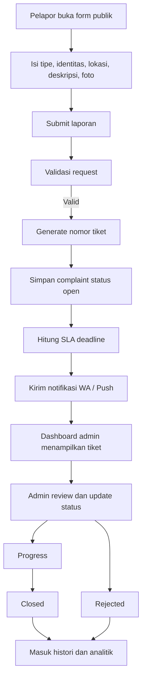
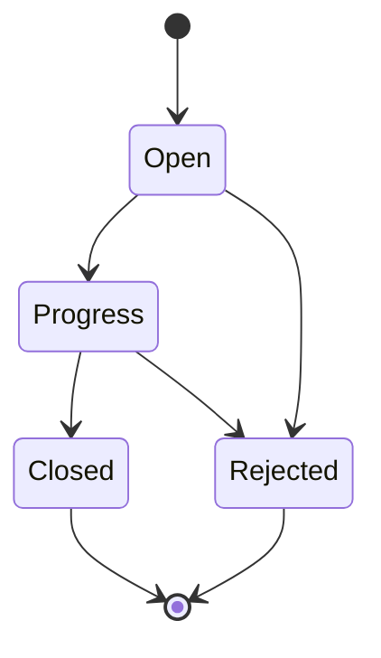
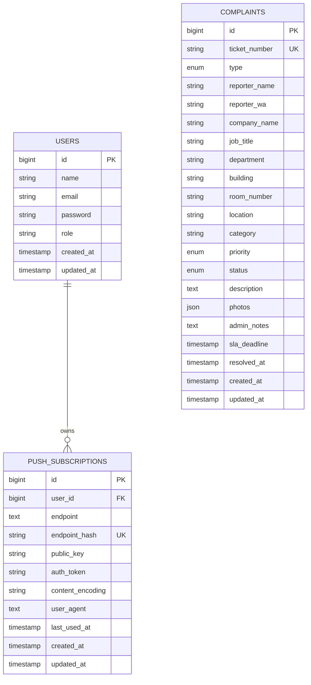

# SCM Complaint Management

Aplikasi pelaporan keluhan fasilitas internal untuk PT Sulawesi Cahaya Mineral. Sistem ini dipakai untuk menerima laporan dari pengguna tanpa login, membuat nomor tiket otomatis, mendistribusikan pekerjaan ke tim Receptionist, Housekeeping, atau Laundry, lalu memantau progres penanganan sampai tiket selesai atau ditolak.

## Tujuan Sistem

- Menyediakan kanal pelaporan fasilitas yang cepat dan mudah dipakai.
- Memisahkan penanganan laporan berdasarkan tipe layanan.
- Menyimpan histori tiket, status, dan lampiran foto secara terstruktur.
- Menyediakan dashboard operasional dan analitik pelapor untuk admin.
- Mengirim notifikasi ke kanal operasional agar tindak lanjut lebih cepat.
- Mendukung penggunaan seperti aplikasi melalui PWA.

## Fitur Utama

### 1. Form laporan publik
- Halaman publik ada di `GET /` dan menggunakan view `resources/views/form.blade.php`.
- Pelapor dapat membuat laporan tanpa login.
- Tipe laporan yang tersedia: `receptionist`, `hk`, dan `laundry`.
- Field bangunan dan perusahaan mendukung pencarian.
- Tersedia opsi input manual jika pilihan default tidak sesuai.
- Pelapor dapat mengunggah hingga 6 foto dengan format `jpg`, `jpeg`, `png`, atau `webp`.
- Setelah submit, sistem membuat nomor tiket otomatis dan mengarahkan pelapor ke halaman sukses.

### 2. Tracking tiket publik
- Pelapor dapat melihat status tiket melalui halaman detail tiket.
- Endpoint AJAX untuk cek tiket tersedia di `GET /api/cek-tiket`.
- Detail tiket menampilkan nomor tiket, status, informasi pelapor, lokasi, dan foto lampiran.

### 3. Dashboard admin
- Login tersedia untuk role `superadmin`, `receptionist`, `hk`, dan `laundry`.
- Setiap role hanya melihat data yang sesuai otoritasnya, kecuali `superadmin` yang melihat semua.
- Dashboard menampilkan ringkasan total, open, progress, closed, rejected, overdue, dan SLA.
- Tab Receptionist, Housekeeping, dan Laundry menampilkan jumlah total non-rejected per tipe pada badge ringkasan.
- Data dashboard diperbarui melalui endpoint statistik internal.

### 4. Manajemen complaint
- Admin dapat melihat daftar laporan, membuka detail, dan memperbarui status.
- Status yang digunakan saat ini: `open`, `progress`, `closed`, dan `rejected`.
- Setiap tiket memiliki `admin_notes`, `sla_deadline`, dan `resolved_at`.
- Foto disimpan pada disk `public` dan diakses melalui `public/storage`.

### 5. Analitik
- Halaman analitik laporan menampilkan distribusi status, prioritas, tipe, dan tren waktu.
- Halaman analitik pelapor mengurutkan pelapor berdasarkan jumlah laporan non-rejected.
- Pelapor tertinggi dapat dibuka untuk melihat log tiket yang pernah dibuat.
- Perhitungan pelapor tertinggi secara eksplisit tidak memasukkan tiket `rejected`.

### 6. Notifikasi
- Laporan baru dapat dikirim ke grup WhatsApp melalui service `app/Services/WhatsappService.php`.
- Aplikasi juga sudah menyiapkan push notification PWA melalui subscription per user.
- Untuk produksi, semua secret notifikasi harus dipindah ke `.env`.

### 7. PWA
- Aplikasi memiliki manifest, service worker, ikon aplikasi, dan fallback offline.
- Ikon PWA menggunakan aset `public/icons/GA-SCM.png` yang diturunkan ke ikon 192px dan 512px.

## Role dan Hak Akses

| Role | Akses |
| --- | --- |
| `superadmin` | Melihat semua complaint, semua analitik, dan CRUD user |
| `receptionist` | Melihat complaint tipe Receptionist dan analitik terkait |
| `hk` | Melihat complaint tipe Housekeeping dan analitik terkait |
| `laundry` | Melihat complaint tipe Laundry dan analitik terkait |

## Alur Proses Bisnis

### Ringkasan alur
1. Pelapor membuka form publik.
2. Pelapor memilih tipe layanan, mengisi lokasi, deskripsi, dan foto.
3. Sistem memvalidasi input lalu membuat ticket number sesuai tipe.
4. Complaint disimpan dengan status awal `open`.
5. Sistem menghitung SLA deadline berdasarkan tipe dan prioritas.
6. Sistem mengirim notifikasi operasional.
7. Admin membuka dashboard dan memproses tiket.
8. Status bergerak dari `open` ke `progress`, lalu `closed`, atau dapat menjadi `rejected`.
9. Data complaint masuk ke dashboard dan analitik sesuai filter tanggal dan role.

### Flowchart proses


### Status flow


## Perhitungan Dashboard dan Analitik

### Ringkasan dashboard
- `total`: seluruh complaint pada scope role dan filter tanggal.
- `open`: jumlah complaint dengan status `open`.
- `progress`: jumlah complaint dengan status `progress`.
- `closed`: jumlah complaint dengan status `closed`.
- `rejected`: jumlah complaint dengan status `rejected`.
- `tab_total`: jumlah badge per tipe di samping ringkasan tab, dihitung dari `open + progress + closed`, sehingga tiket `rejected` tidak ikut masuk.

### Analitik pelapor
- Data pelapor dikelompokkan berdasarkan `reporter_wa`.
- Jika nomor telepon kosong, sistem fallback ke gabungan nama pelapor.
- Peringkat pelapor tertinggi hanya memakai complaint dengan status selain `rejected`.
- Log detail pelapor menampilkan daftar tiket non-rejected milik pelapor yang dipilih.

## Arsitektur Data

### Entitas utama
- `users`: akun admin dan operator.
- `complaints`: inti data tiket dan operasional complaint.
- `push_subscriptions`: daftar perangkat browser yang menerima push notification.
- `cache`, `jobs`, dan tabel Laravel lain: pendukung framework.

### ERD


## Struktur Folder Penting

- `app/Http/Controllers`
  File controller utama untuk auth, complaint, dashboard, tiket, analytics, reporter, push subscription, dan user management.
- `app/Models/Complaint.php`
  Model utama complaint, generator tiket, label status, dan perhitungan SLA.
- `app/Services/WhatsappService.php`
  Pengiriman notifikasi grup WhatsApp.
- `app/Services/WebPushService.php`
  Pengiriman notifikasi push ke browser yang sudah subscribe.
- `resources/views/form.blade.php`
  Form pelaporan publik.
- `resources/views/dashboard/index.blade.php`
  Dashboard utama dan ringkasan per tipe.
- `resources/views/reporters/index.blade.php`
  Analitik pelapor dan log pelapor tertinggi.
- `public/sw.js`
  Service worker untuk PWA dan push notification.
- `config/buildings.php`
  Master data bangunan.
- `config/companies.php`
  Master data perusahaan.

## Routing Penting

### Public route
- `GET /` : form laporan publik
- `POST /complaint/submit` : simpan complaint baru
- `GET /complaint/success` : halaman sukses submit
- `GET /tiket/{ticket}` : detail tiket publik
- `GET /api/cek-tiket` : pencarian tiket via AJAX
- `GET /api/push/public-key` : public key push notification

### Authenticated route
- `GET /dashboard` : dashboard utama
- `GET /complaints` : daftar complaint
- `GET /complaints/{complaint}` : detail complaint admin
- `PATCH /complaints/{complaint}/status` : update status complaint
- `GET /api/new-complaints` : polling complaint/notifikasi
- `GET /api/dashboard-stats` : statistik dashboard
- `POST /api/push/subscribe` : simpan subscription push
- `DELETE /api/push/unsubscribe` : hapus subscription push
- `GET /analytics` : analitik laporan
- `GET /reporters` : analitik pelapor

### Superadmin route
- `GET /users`
- `GET /users/create`
- `POST /users`
- `GET /users/{user}/edit`
- `PUT /users/{user}`
- `DELETE /users/{user}`

## Setup Lokal

### 1. Clone project
```bash
git clone <repo-url>
cd ga_facility_compliance
```

### 2. Install dependency
```bash
composer install
npm install
```

### 3. Siapkan environment
```bash
copy .env.example .env
php artisan key:generate
```

Contoh konfigurasi minimum:
```env
APP_NAME="SCM Complaint Management"
APP_ENV=local
APP_DEBUG=true
APP_URL=http://localhost

DB_CONNECTION=mysql
DB_HOST=127.0.0.1
DB_PORT=3306
DB_DATABASE=ga_facility_compliance
DB_USERNAME=root
DB_PASSWORD=
```

### 4. Buat database dan migrasi
```bash
php artisan migrate
php artisan db:seed
```

### 5. Siapkan storage upload
```bash
php artisan storage:link
php artisan hosting:prepare-storage
```

### 6. Jalankan aplikasi
```bash
php artisan serve
npm run dev
```

## Akun Seeder Default

| Email | Role | Password |
| --- | --- | --- |
| `superadmin@ga.com` | `superadmin` | `password123` |
| `receptionist@ga.com` | `receptionist` | `password123` |
| `hk@ga.com` | `hk` | `password123` |
| `laundry@ga.com` | `laundry` | `password123` |

## Format Ticket Number

| Tipe | Prefix | Contoh |
| --- | --- | --- |
| Receptionist | `RCP` | `RCP-0001` |
| Housekeeping | `HKP` | `HKP-0001` |
| Laundry | `LDY` | `LDY-0001` |

## Upload Foto

- Upload bersifat opsional.
- Maksimal 6 file per laporan.
- Format yang diterima: `jpg`, `jpeg`, `png`, `webp`.
- Maksimal ukuran per file: 5 MB.
- File disimpan pada `storage/app/public/complaints`.
- Agar file tampil dari browser, symlink `public/storage` harus ada.

## Persiapan Hosting dan Produksi

### Checklist minimum
- Gunakan `APP_ENV=production`.
- Gunakan `APP_DEBUG=false`.
- Pastikan `APP_URL` sesuai domain HTTPS.
- Jalankan `php artisan hosting:prepare-storage`.
- Pastikan folder `storage` dan `bootstrap/cache` writable.
- Pastikan `public/storage` mengarah ke `storage/app/public`.
- Gunakan user database khusus, jangan `root`.
- Pindahkan secret notifikasi ke `.env`.
- Jalankan cache config setelah deploy final.

### Command deploy yang umum dipakai
```bash
php artisan optimize:clear
php artisan migrate --force
php artisan storage:link
php artisan hosting:prepare-storage
php artisan config:cache
php artisan route:cache
```

## Variabel Environment yang Perlu Diperhatikan

```env
APP_NAME="SCM Complaint Management"
APP_ENV=production
APP_DEBUG=false
APP_URL=https://your-domain.com

DB_CONNECTION=mysql
DB_HOST=127.0.0.1
DB_PORT=3306
DB_DATABASE=ga_facility_compliance
DB_USERNAME=your_user
DB_PASSWORD=your_password

FONNTE_TOKEN=
FONNTE_GROUP_ID=

VAPID_PUBLIC_KEY=
VAPID_PRIVATE_KEY=
VAPID_SUBJECT=mailto:admin@example.com
```

## Command Berguna

```bash
php artisan optimize:clear
php artisan optimize
php artisan migrate
php artisan db:seed
php artisan storage:link
php artisan hosting:prepare-storage
php artisan test
```

## Catatan Pengembangan

- Layout admin memakai AdminLTE yang sudah disesuaikan.
- Form publik memakai `Choices.js` untuk searchable select.
- Date filter analytics memakai `Flatpickr`.
- Chart analytics menggunakan `Chart.js`.
- Badge tab dashboard per tipe memakai total non-rejected.
- Analitik pelapor tertinggi sekarang mengecualikan status `rejected`.

## Rekomendasi Pengembangan Lanjutan

- Pindahkan seluruh kredensial notifikasi ke konfigurasi `.env` yang aman.
- Tambahkan queue worker untuk pengiriman notifikasi WhatsApp dan push.
- Tambahkan audit trail perubahan status complaint.
- Tambahkan automated test untuk submit complaint, update status, dan analytics.
- Tambahkan export laporan per periode.

## Lisensi

Project ini mengikuti lisensi default Laravel kecuali ada kebijakan internal perusahaan yang mengatur berbeda.
